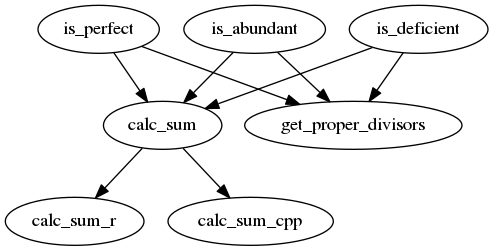

# cirthree

Lessen 3 of [collaboration_in_r](https://github.com/richelbilderbeek/collaboration_in_r).

Branch|[Travis](https://travis-ci.org)|[Codecov](https://www.codecov.io)
---|---|---
`master` ||
`develop`||
